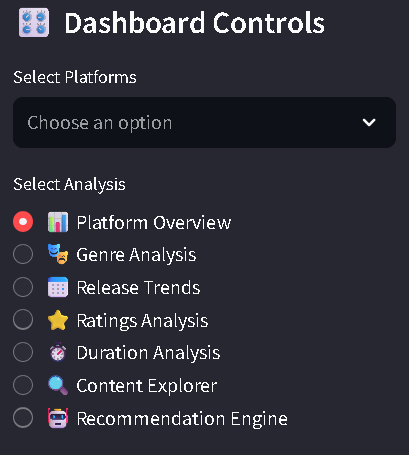
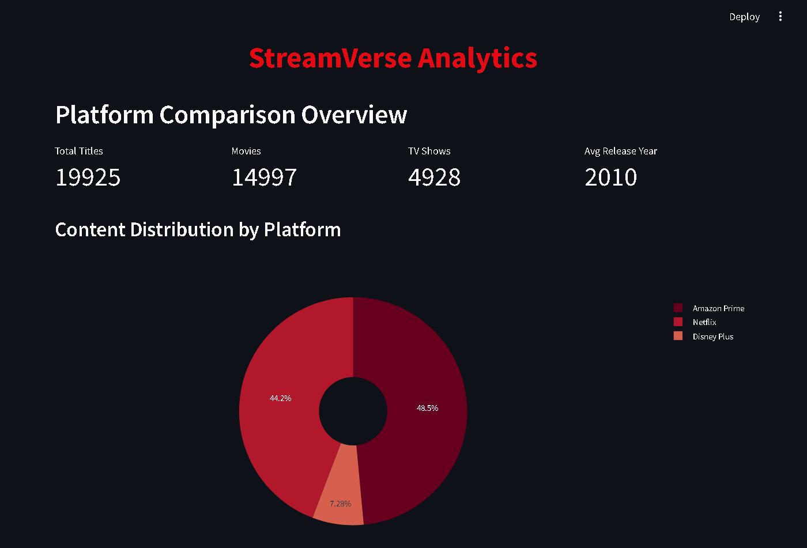

[](https://your-app-url.streamlit.app/)
[](https://opensource.org/licenses/MIT)
[](https://www.python.org/downloads/)


# 🎬 Streaming Platform Analytics Dashboard

 <!-- Add a screenshot later -->

A comprehensive analytics dashboard comparing content across Netflix, Amazon Prime, Disney+, and Hulu with recommendation features.

## ✨ Features

- Multi-platform content comparison
- Interactive visualizations (Plotly, Matplotlib)
- Content-based recommendation system
- Genre analysis with word clouds
- Release trends and ratings analysis

## 🛠️ Installation

1. Clone the repository:
   ```bash
   git clone https://github.com/Milind39/Streaming-Analytics-Dashboard.git
   ```

2. Install dependencies:
   ```bash
   pip install -r requirements.txt
   ```

3. Run the Streamlit app:
   ```bash
   streamlit run app.py
   ```

## 📂 Data Sources

- Netflix data: [Kaggle](https://www.kaggle.com/datasets/shivamb/netflix-shows)
- Amazon Prime data: [Kaggle](https://www.kaggle.com/datasets/shivamb/amazon-prime-movies-and-tv-shows)
- Disney+ data: [Kaggle](https://www.kaggle.com/datasets/shivamb/disney-movies-and-tv-shows)
- Hulu data: [Kaggle](https://www.kaggle.com/datasets/shivamb/hulu-movies-and-tv-shows)


# Add this to your README.md






## 🤝 Contributing

Contributions are welcome! Please open an issue or submit a pull request.

## 📜 License
[MIT](LICENSE)